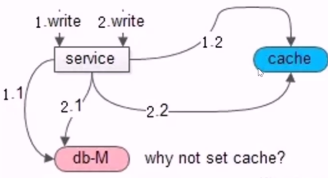
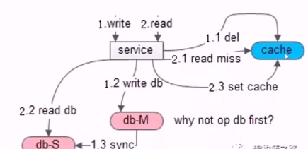

# 缓存最佳实践

缓存一般为 KV 结构，value 一般存储的数据类型主要有：

+ 朴素型数据，例如： int
+ 序列后的对象，例如： user 的实体，本质是二进制
+ 文本数据，例如： json 或者 html

对缓存的数据，一般使用 Cache Aside Pattern。

Cache Aside Pattern 包含读实践和写实践。

+ 读实践：先读 cache 再读 db，如果 cache hit 直接返回，cache miss 访问 db, 同时再写入 cache.
+ 写实践：使用淘汰缓存而不是修改缓存。另一个是先写数据库再淘汰缓存。
    + 为何使用淘汰缓存而不是更新缓存。如果更新缓存在并发写时，可能出现数制不一致。详细可看下图1
    + 为何先写数据库再淘汰缓存。如果先操作缓存，在读写并发时，可能导致数据不一致。详细可看下图2

