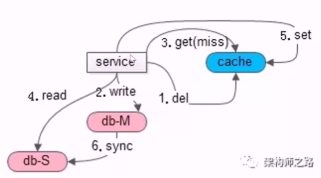

# 缓存一致性

数据库与缓存不一致。如下图：

为什么会不一致，根本原因是数据冗余引发的数据不一致问题。

+ 主库与主库的冗余会引主主一致性问题
+ 主库与从库的冗余会引发主从一致性问题
+ 数据库与缓存的冗余会引发数据库与缓存不一致的问题。数据库与缓存的不一致主要是由于数据库的主从不一致引起的。当主库上发生写操作后，从库 binlog 同步的时间间隔内，读请求有可能导致旧数据入到缓存里。

数据库与缓存的不一致如休进行优化？主要有以下几个方案：

+ 异步二次淘汰法。写后立即读，导致缓存中有脏数据后。在主从同步完成后，watch 到同步完成的消息，增加一个异步淘汰缓存的动作。
+ 服务二次淘汰法。写后立即读，导致缓存中有脏数据后。此时，可在服务启动一个定时器，定时器的时间有主从同步的完成大概时间，一段时间后，把数据从缓存中删除。
+ 为允许 cache miss 的场景，设定超时时间。
