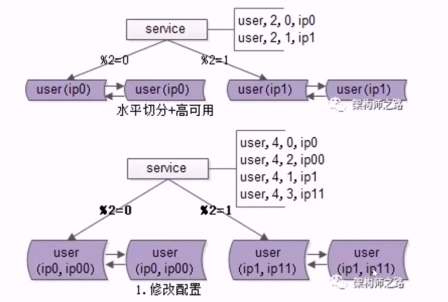

# 数据库扩展性

数据库扩展性要如何解决。其存在几种潜在的场景。

1. 底层表结构变更。在数据量很大的情况下，数据表结构变更，此时不可能直接 alter table。因为数据量和并发量都比较大，alter 会锁住表。
2. 水平扩展，分库个数变化。当数据量逐渐变大，需要进行水平扩展。
3. 底层存储介质的变化。例如存储从 mysql 变为 mongoDb。

如何解决这些扩展性的需要，主要有以下几种方案。

1. 停服扩展。不管是什么场景都可以使用停服扩展。其主要步骤有：挂广告停服，研发一个离线的数据库迁移工具，恢复服务。停服扩展影响服务的可用性。
2. 在线表结构变更（online schema change）。其主要步骤是：先创建一个扩展后的新表，然后在原表上创建三个触发器对`insert`、`delete`和`update`的操作都会同步更新到新表，接着将原表中的数据分批导入新表，再然后删除触发器和原表，最后重命名新表为原表。
3. 追日志方案。其步骤如下：
    1. 对服务进行升级，记录数据库的变更操作日志。服务升级风险很小。
    2. 研发数据迁移工具。将数据从旧库迁移到新库。
    3. 追日志。读取日志，记录有哪些发生变化，将有变化从旧库导到新库。
    4. 数据对比。比对旧库和新库的数据是否完全一样。
    5. 流量迁移。流量从旧库迁移到新库。
4. 双写方案。是一个高可用的平滑迁移方案。其主要有以下几个步骤：
    1. 对服务升级。对写接口在新库上进行相同的操作。
    2. 研发数据迁移工具。将数据从旧库移到新库。
    3. 数据对比。
    4. 流量迁移。

## 水平切分，秒级扩容

数据量持续增大，两个分库已满足不了，此时需要进行水平拆分。水平拆分需要成倍的拆分才能实现秒级的扩容。其主要分三步走。

1. 修改配置。如下图，最初是两个数据库提供服务，%2＝0，到ip0,%2=1到ip1。然后修改数据库配置，在数据库原有的实例做双虚 ip，接着修改服务的配置 %4＝0到ip0,%4=2到ip00,%4=1到ip1, %4=3到 ip11。由于是成倍的扩容，%4＝0和%4=2对应%2＝0，%4=1和%4=3对应%2=1。
2. readload 配置完成。
3. 数据收缩。解除旧的双主同步，新增新的双主同步，同时删除冗余数据。

