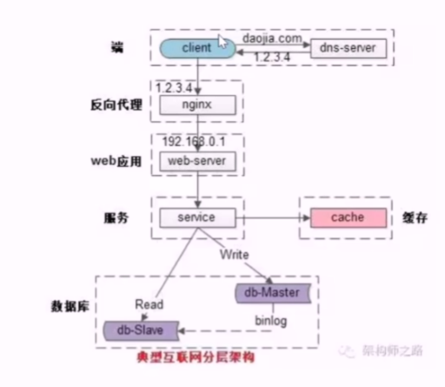

# 微服务高可用

什么是高可用，他通常中指减少系统不能提供服务的时间。

如何保障系统的高可用：

+ 集群冗余
+ 故障自动转移

常见的微服务分层架构如下：

1. 端到反向代理的高可用，通过 keepalived + virtual IP 来保证
2. 反向代理到站点应用的高可用。反向代理配置多个站点的配置。通过站点层的冗余来实现。
3. 站点应用到微服务的高可用。通过服务层的集群冗余。上流调用方是服务连接池，会建立与下游多个服务的连接。通过随机，轮询，一致性哈希等方式来选取连接池中的连接。
4. 微服务到缓存的高可用。比如redis,redis 天然支持高可用。 redis-sentinel。缓存架构，避免数据雪崩压跨数据库即可。
5. 微服务到读库的高可用。一主多从。从从库读取数据。
6. 微服务到写库的高可用。通过写库的冗余来实现。通过 keepalived + virtual IP 来保证。