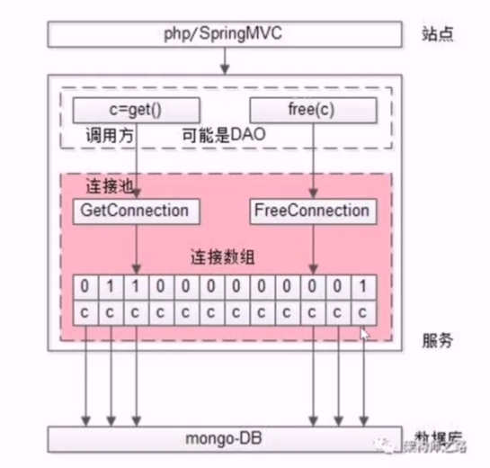

# 微服务连接池

在有连接池之前，访问下游服务都是通过3个步骤：建立连接，通过连接收发请求，关闭连接。

有连接池之后，访问下游服务： 获取一个连接，通过连接收发请求，放回连接。有连接池之后，建立连接，关闭连接是事先建好，事后销毁。

连接池主要的核心如下图：

核心接口主要有3个：

+ init 初始化连接，在业务启动时操作。
+ get_connection 请求前从连接池中拿一个接口。
+ free_connection 请求后放回连接池。

