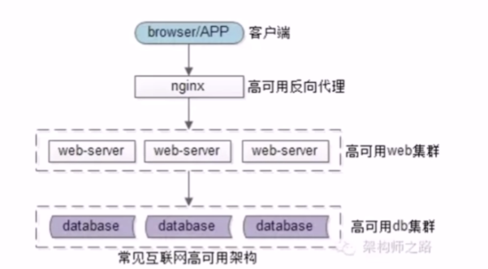

# 为什么要服务化

一般公司的业务典型架构如下图：

## 痛点

随着流量的增长，会出现许多的痛点。

1. 不同业务都要访问数据库，代码到处拷贝。
2. 随着并发越来越高，用户数据的访问，数据库成为了瓶颈。需要加入缓存层来降低数据库的压力。如果没有统一的服务，所有的业务都需要加入缓存层的代码。导致底层复杂性的扩散。
3. 为了解决以上两点，首先想到的办法是抽出公共库。这会导致公共库的耦合。
4. 所有的业务都需要访问数据库，不同的人写出代码的质量不同。一个代质量的代码导致访问数据库的质量无法保障
5. 不同的业务会有自己的个性化存储。导致数据库耦合，不容易扩展。

## 服务化

引入一个通用的服务层，可以解决上面的问题。

服务化的好处：

1. 复用性，消除代码拷贝。都通过服务层来访问，代码只此一份。
2. 专注性，防止复杂性扩散。
3. 解耦合，消除公共库耦合。
4. 服务层由比较专业的工程师编写，数据库稳定性有保障。
5. 容易扩展，消除数据库耦合。
6. 高效率，业务调用方访问数据库，只要像调用本地函数一样。研发效率大大提升。

## 潜在问题

服务化后，业务潜在的问题

1. 系统复杂性上升。
2. 层间依赖性关系变得复杂。
3. 运维，部署更麻烦。
4. 监控变得更复杂。
5. 定位问题更麻烦。

服务化，并不是简单的引入一个 RPC 框架。他需要，一系列的基础设施来保障。 