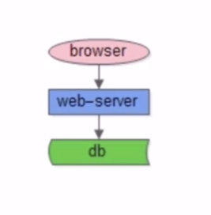
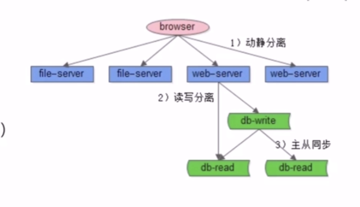

# 百万流量架构

系统早期是 all in one 架构。所有的业务都在一个组件上。如下图：

随着访问人数的增多，系统遇到瓶颈。同时，当出现问题的时候，系统会整个挂掉。这时，此阶段的优化思路是:

1. 以解决业务问题为导向，技术不炫技。
2. 系统改造尽可能小的架构方案。
3. 以最快的速度，提升系统的性能。

此时，就存在一些问题。

### 如何突破单机资源限制，提升性能？

解决方案主要有：伪分布式和三在分离

所谓伪分布式就是增加硬件资源，提升系统性能，增加访问速度。

三大分离包括动静分离，读写分离，前后台分离。

#### 动静分离

动静分离是静态页面与动态页面分开，分别访问不同的系统

静态页面一般几毫秒返回，动态页面几百毫秒返回，性能差100倍，有没可能把动态变成静态。这就是页面静态化技术。

页面静态化技术适用于数据量不是特别大，返回结果集有限。例如：城市详情页，

#### 读写分离

一主多从，读写分离，主从同步。主库提供读写服务，从库提供读服务。主从同步数据。
分组架构主要解决数据库读性能的问题。通过线性增加，提高系统的读性能。

#### 前后台分离

前台发布使用的数据库和后台抓取的数据库耦合，后台修改数据库会影响前台。

代码拆分，数据库拆分进行解耦。不在不通数据库，而是通过数据库转换层，

### 如何解除耦合，缩小故障范围？

进行拆分。

+ 业务垂直拆分。
+ 代码垂直拆分,子系统解耦。
+ 数据库垂直拆分。数据库量降低，延时缓解。
+ 研发团队垂直拆分，专业化提升效率。

### 拆分后，子系统高可用？

引入反向代理，子系统性能不再受单台机器资源限制，可以扩展。同时子系统也实现了高可用。

### 如何负载均衡？

负载均衡方法：

+ 随机
+ 轮询
+ 静态权重
+ 一致性

### 反向代理如何高可用？

反向代理高可用使用：keepalived + vip

### 反向代理前，接入层如何扩展?

DNS轮询技术

### 一致性session?

一致性 session 主要有以下 4 种方法

1. session 同步，多台同步数据
2. 客户端存储。 session 存在客户端，客户端访问时，从本地读取。
3. 反向代理 hash 一致性（四层和七层）
4. 后端统一存储

一般是使用后2种。

### 静态资源加速?

使用CDN加速。

CDN 加速保证一致性的最佳实践：

+ 资源更新使用拉，而不是推
+ 常用的静态资源加版本号

、

