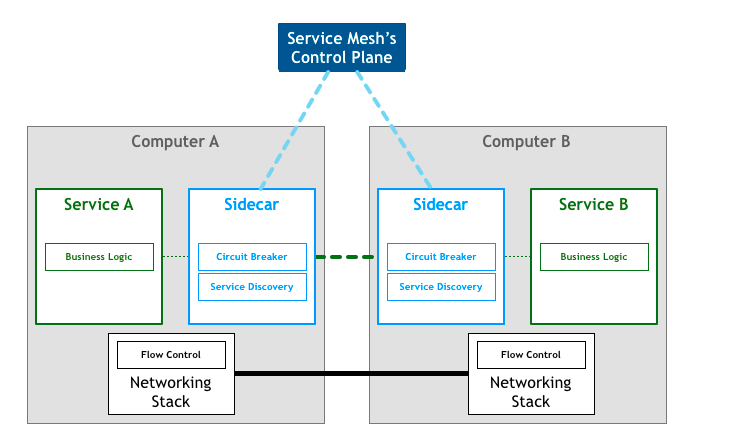
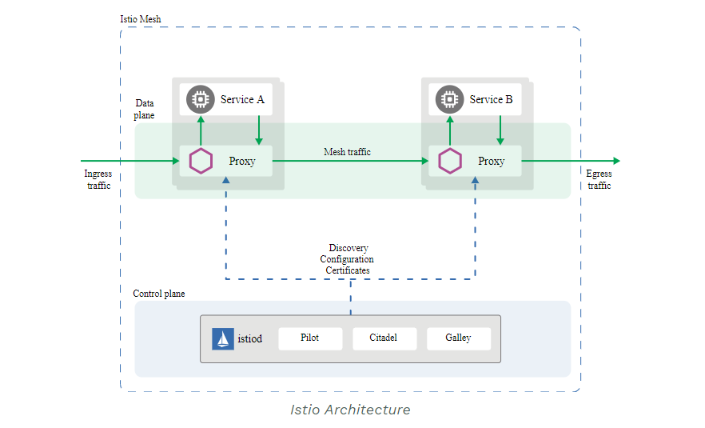
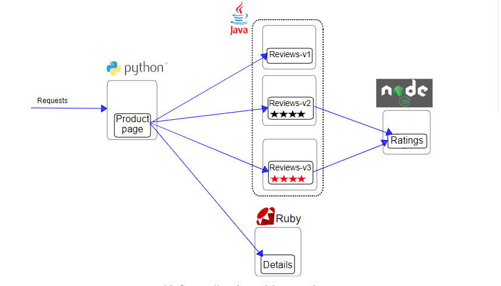

# Istio 分享

## 什么是 Istio

Istio 有助于降低云平台部署的复杂性，并减轻开发团队的压力。它是一个完全开源的服务网格，作为透明的一层接入到现有的分布式应用程序里。它也是一个平台，拥有可以集成任何日志、遥测和策略系统的 API 接口。Istio 多样化的特性使您能够成功且高效地运行分布式微服务架构，并提供保护、连接和监控微服务的统一方法。

### 什么是服务网格

Service Mesh是专用的基础设施层，轻量级高性能网络代理。提供安全的、快速的、可靠地服务间通讯，与实际应用部署一起，但对应用透明。

服务网格的典型边车部署方式：



当有大量服务相互调用时，它们之间的服务调用关系就会形成网格，如下图所示：


Istio 也可以认为是一种服务网络。

## Istio 的功能是什么（能做什么）

通过负载均衡、服务间的身份验证、监控等方法，Istio 可以轻松地创建一个已经部署了服务的网络，而服务的代码只需很少更改甚至无需更改。通过在整个环境中部署一个特殊的 sidecar 代理为服务添加 Istio 的支持，而代理会拦截微服务之间的所有网络通信，然后使用其控制平面的功能来配置和管理 Istio。其功能包括以下四大方面：

connect, secure, control, and observe services.

connect: 智能控制服务间的流量和 API 调用，进行一系列的测试，并通过红/黑部逐步升级。 具体表现为流量管理。

secure: 通过托管身份认证、授权和服务之间通信加密自动保护服务。 具体表现：灵活的服务控制，双向 TLS 和细粒度的访问策略。

control: 应用策略并确保执行，使得资源在消费者之间公平分配。具体表现： Mix 策略和遥测。

observe: 对一切的服务进行多样化，自动化的追踪、监控以及记录日志，以便实时了解正在发生的事情。具体表现： metrice 指标采集，可视化。日志收集。链路追踪。

### 架构

Istio服务网格逻辑上分为数据面板和控制面板。
+ 数据面板由一组智能代理（Envoy）组成，代理部署为边车，调解和控制微服务之间所有的网络通信。
+ 控制面板负责管理和配置代理来路由流量，以及在运行时执行策略。



+ Proxy(Envoy)： 代理出入口流量。 Prxoy 形成一个安全的微服务风格，提供丰富的功能。
+ Pilot: 负责在运行时配置代理的组件。
+ Citadel: 负责证书发行和更换的中央组件
+ Gally: 用于验证，摄取，聚合，转换和Istio分发配置核心组成部分。

## 事例演示

如何自动注入 sidecar:

+ 命名空间增加 sidecar 标签。
+ yaml 文件增加 sidecar 标签。

下面的功能大部分都是基于以下这个事例来做演示

应用分为四个单独的微服务：

+ productpage. 这个微服务会调用 details 和 reviews 两个微服务，用来生成页面。
+ details. 这个微服务中包含了书籍的信息。
+ reviews. 这个微服务中包含了书籍相关的评论。它还会调用 ratings 微服务。
+ ratings. 这个微服务中包含了由书籍评价组成的评级信息。
其中 reviews 微服务又分为 3 个版本：


+ v1 版本不会调用 ratings 服务。
+ v2 版本会调用 ratings 服务，并使用 1 到 5 个黑色星形图标来显示评分信息。
+ v3 版本会调用 ratings 服务，并使用 1 到 5 个红色星形图标来显示评分信息。

下图展示了这个应用的端到端架构。



在页面上输入：http://192.168.239.200:32002/productpage（服务使用 NodePort 部署的） 可看到生成的页面有3种情况：


### 流量管理

Istio 的流量路由规则可以让您很容易的控制服务之间的流量和 API 调用。Istio 简化了服务级别属性的配置，比如熔断器、超时和重试，并且能轻松的设置重要的任务，如 A/B 测试、金丝雀发布、基于流量百分比切分的概率发布等。它还提供了开箱即用的故障恢复特性，有助于增强应用的健壮性，从而更好地应对被依赖的服务或网络发生故障的情况。

Istio 的流量管理模型源于和服务一起部署的 Envoy 代理。网格内服务发送和接收的所有流量（data plane流量）都经由 Envoy 代理，这让控制网格内的流量变得异常简单，而且不需要对服务做任何的更改。

TCP 流量转移，镜像，请求超时，出口网关路由配置。

#### 请求路由

##### 路由到同个版本

开启默认目标规则：

```
kubectl apply -f samples/bookinfo/networking/destination-rule-all.yaml
```

开启路由规则，流量流向 v1 版本。

```
kubectl apply -f samples/bookinfo/networking/virtual-service-all-v1.yaml
```

可以看到流量只流向 v1.


##### 基于用户身份的路由

开启基本用户身份的路由， jason 用户流向 v2，其它不变。

```
kubectl apply -f samples/bookinfo/networking/virtual-service-reviews-test-v2.yaml
```

可看到登入的特定用户的流量流向 v2.


#### 故障注入

如何注入故障并测试应用程序的弹性。

测试微服务应用程序的弹性，我们将为用户 jason 在 reviews:v2 和 ratings 服务之间注入一个 7 秒的延迟。 这个测试将会发现一个故意引入 Bookinfo 应用程序中的 bug。

注意 reviews:v2 服务对 ratings 服务的调用具有 10 秒的硬编码连接超时。 因此，尽管引入了 7 秒的延迟，我们仍然期望端到端的流程是没有任何错误的。

创建故障注入规则以延迟来自测试用户 jason 的流量：

```
kubectl apply -f samples/bookinfo/networking/virtual-service-ratings-test-delay.yaml
```

应用主页在大约 7 秒钟加载完成并且没有错误。 但是，出现了一个问题：Reviews 部分显示了错误消息：

```
Error fetching product reviews!
Sorry, product reviews are currently unavailable for this book.
```

按照预期，我们引入的 7 秒延迟不会影响到 reviews 服务，因为 reviews 和 ratings 服务间的超时被硬编码为 10 秒。 但是，在 productpage 和 reviews 服务之间也有一个 3 秒的硬编码的超时，再加 1 次重试，一共 6 秒。 结果，productpage 对 reviews 的调用在 6 秒后提前超时并抛出错误了。

这种类型的错误可能发生在典型的由不同的团队独立开发不同的微服务的企业应用程序中。 Istio 的故障注入规则可以帮助您识别此类异常，而不会影响最终用户。

#### 流量转移

展示如何逐步将流量从一个版本的微服务迁移到另一个版本。例如，您可以将流量从旧版本迁移到新版本。

一个常见的用例是将流量从一个版本的微服务逐渐迁移到另一个版本。在 Istio 中，您可以通过配置一系列规则来实现此目标， 这些规则将一定百分比的流量路由到一个或另一个服务。在本任务中，您将会把 50％ 的流量发送到 reviews:v1，另外 50％ 的流量发送到 reviews:v3。然后，再把 100％ 的流量发送到 reviews:v3 来完成迁移

开启所有流量路由到 v1 版本

```
kubectl apply -f samples/bookinfo/networking/virtual-service-all-v1.yaml
```

打开页面，不管页面刷新多少次，页面的评论部分都不会显示评级星号。

把 50% 的流量从 reviews:v1 到 reviews:v3:

```
kubectl apply -f samples/bookinfo/networking/virtual-service-reviews-50-v3.yaml
```

刷新浏览器中的 /productpage 页面，大约有 50% 的几率会看到页面中出带 红色 星级的评价内容。这是因为 v3 版本的 reviews 访问了带星级评级的 ratings 服务，但 v1 版本却没有。

`在目前的 Envoy sidecar 实现中，可能需要刷新 /productpage 很多次–可能 15 次或更多–才能看到正确的流量分发的效果。您可以通过修改规则将 90% 的流量路由到 v3，这样能看到更多带红色星级的评价。`

开启流量 100% 路由到 reviews:v3

```
kubectl apply -f samples/bookinfo/networking/virtual-service-reviews-v3.yaml
```

#### 熔断

熔断，是创建弹性微服务应用程序的重要模式。熔断能够使您的应用程序具备应对来自故障、潜在峰值和其他 未知网络因素影响的能力。

##### 配置熔断

部署 httpbin 服务：

```
kubectl apply -f samples/httpbin/httpbin.yaml
```

开启熔断规则：

```
kubectl apply -f samples/httpbin/httpbin-dr.yaml
```

#####　增加测试客户端

创建客户端程序以发送流量到 httpbin 服务。这是一个名为 Fortio 的负载测试客户的，其可以控制连接数、并发数及发送 HTTP 请求的延迟。通过 Fortio 能够有效的触发前面 在 DestinationRule 中设置的熔断策略。

部署 Fortio 应用

```
kubectl apply -f samples/httpbin/sample-client/fortio-deploy.yaml
```

Fortio 工具调用 httpbin 服务。测试连通性。

```
[root@master istio-1.6.3]# kubectl exec -it fortio-deploy-6dc9b4d7d9-zsxwr -c fortio -- /usr/bin/fortio load -curl  http://httpbin:8000/get 
HTTP/1.1 200 OK
server: envoy
date: Sun, 05 Jul 2020 14:20:16 GMT
content-type: application/json
content-length: 621
access-control-allow-origin: *
access-control-allow-credentials: true
x-envoy-upstream-service-time: 33

{
  "args": {}, 
  "headers": {
    "Content-Length": "0", 
    "Host": "httpbin:8000", 
    "User-Agent": "fortio.org/fortio-1.3.1", 
    "X-B3-Parentspanid": "f679841d0fbd7fa4", 
    "X-B3-Sampled": "1", 
    "X-B3-Spanid": "e2441fed6a6431dc", 
    "X-B3-Traceid": "702877d85411ee5df679841d0fbd7fa4", 
    "X-Envoy-Attempt-Count": "1", 
    "X-Forwarded-Client-Cert": "By=spiffe://cluster.local/ns/default/sa/httpbin;Hash=55654b5e0a68f5af3c048ab8a565fa94a07b74416abc9c9160309ba63b1ffa0a;Subject=\"\";URI=spiffe://cluster.local/ns/default/sa/default"
  }, 
  "origin": "127.0.0.1", 
  "url": "http://httpbin:8000/get"
}

```

#####　触发熔断

在熔断规则配置中，定义了 maxConnections: 1 和 http1MaxPendingRequests: 1。 这些规则意味着，如果并发的连接和请求数超过一个，在 istio-proxy 进行进一步的请求和连接时，后续请求或连接将被阻止。

发送并发数为 3 的连接（-c 3），请求 30 次（-n 30）：

```
[root@master istio-1.6.3]#  kubectl exec -it  fortio-deploy-6dc9b4d7d9-zsxwr   -c fortio -- /usr/bin/fortio load -c 3 -qps 0 -n 30 -loglevel Warning http://httpbin:8000/get
14:36:20 I logger.go:97> Log level is now 3 Warning (was 2 Info)
Fortio 1.3.1 running at 0 queries per second, 2->2 procs, for 30 calls: http://httpbin:8000/get
Starting at max qps with 3 thread(s) [gomax 2] for exactly 30 calls (10 per thread + 0)
14:36:20 W http_client.go:679> Parsed non ok code 503 (HTTP/1.1 503)
14:36:20 W http_client.go:679> Parsed non ok code 503 (HTTP/1.1 503)
14:36:20 W http_client.go:679> Parsed non ok code 503 (HTTP/1.1 503)
14:36:20 W http_client.go:679> Parsed non ok code 503 (HTTP/1.1 503)
14:36:20 W http_client.go:679> Parsed non ok code 503 (HTTP/1.1 503)
14:36:20 W http_client.go:679> Parsed non ok code 503 (HTTP/1.1 503)
14:36:20 W http_client.go:679> Parsed non ok code 503 (HTTP/1.1 503)
14:36:20 W http_client.go:679> Parsed non ok code 503 (HTTP/1.1 503)
14:36:20 W http_client.go:679> Parsed non ok code 503 (HTTP/1.1 503)
14:36:20 W http_client.go:679> Parsed non ok code 503 (HTTP/1.1 503)
14:36:20 W http_client.go:679> Parsed non ok code 503 (HTTP/1.1 503)
14:36:20 W http_client.go:679> Parsed non ok code 503 (HTTP/1.1 503)
14:36:20 W http_client.go:679> Parsed non ok code 503 (HTTP/1.1 503)
14:36:20 W http_client.go:679> Parsed non ok code 503 (HTTP/1.1 503)
14:36:20 W http_client.go:679> Parsed non ok code 503 (HTTP/1.1 503)
14:36:20 W http_client.go:679> Parsed non ok code 503 (HTTP/1.1 503)
14:36:20 W http_client.go:679> Parsed non ok code 503 (HTTP/1.1 503)
14:36:20 W http_client.go:679> Parsed non ok code 503 (HTTP/1.1 503)
14:36:20 W http_client.go:679> Parsed non ok code 503 (HTTP/1.1 503)
Ended after 105.249625ms : 30 calls. qps=285.04
Aggregated Function Time : count 30 avg 0.0063918479 +/- 0.00881 min 0.000442682 max 0.040051847 sum 0.191755436
# range, mid point, percentile, count
>= 0.000442682 <= 0.001 , 0.000721341 , 23.33, 7
> 0.001 <= 0.002 , 0.0015 , 50.00, 8
> 0.002 <= 0.003 , 0.0025 , 53.33, 1
> 0.003 <= 0.004 , 0.0035 , 56.67, 1
> 0.004 <= 0.005 , 0.0045 , 66.67, 3
> 0.005 <= 0.006 , 0.0055 , 73.33, 2
> 0.006 <= 0.007 , 0.0065 , 76.67, 1
> 0.007 <= 0.008 , 0.0075 , 80.00, 1
> 0.012 <= 0.014 , 0.013 , 83.33, 1
> 0.014 <= 0.016 , 0.015 , 86.67, 1
> 0.016 <= 0.018 , 0.017 , 90.00, 1
> 0.02 <= 0.025 , 0.0225 , 96.67, 2
> 0.04 <= 0.0400518 , 0.0400259 , 100.00, 1
# target 50% 0.002
# target 75% 0.0065
# target 90% 0.018
# target 99% 0.0400363
# target 99.9% 0.0400503
Sockets used: 20 (for perfect keepalive, would be 3)
Code 200 : 11 (36.7 %)
Code 503 : 19 (63.3 %)
Response Header Sizes : count 30 avg 84.466667 +/- 111 min 0 max 231 sum 2534
Response Body/Total Sizes : count 30 avg 464.8 +/- 294.1 min 241 max 852 sum 13944
All done 30 calls (plus 0 warmup) 6.392 ms avg, 285.0 qps
```

现在，您将开始看到预期的熔断行为，只有 36.7 % 的请求成功，其余的均被熔断器拦截：

```
Code 200 : 11 (36.7 %)
Code 503 : 19 (63.3 %)
```

清除熔断规则：

```
kubectl delete -f samples/httpbin/httpbin-dr.yaml
```

#### 入口网关路由配置

在 Kubernetes 环境中，使用 Kubernetes Ingress 资源来指定需要暴露到集群外的服务。 在 Istio 服务网格中，更好的选择（同样适用于 Kubernetes 及其他环境）是使用一种新的配置模型，名为 Istio Gateway。 Gateway 允许应用一些诸如监控和路由规则的 Istio 特性来管理进入集群的流量。

创建 Istio Gateway:

```
kubectl apply -f samples/httpbin/httpbin-host-gateway.yaml
```

创建 Istio 的入口流量配置路由：

```
kubectl apply -f samples/httpbin/httpbin-host-vs.yaml
```

已为 httpbin 服务创建了虚拟服务配置，包含两个路由规则，允许流量流向路径 /status 和 /delay。

gateways 列表规约了哪些请求允许通过 httpbin-gateway 网关。 所有其他外部请求均被拒绝并返回 404 响应。

curl 访问路径 /status

```
[root@master httpbin]# curl -I -HHost:httpbin.example.com http://192.168.239.201:32720/status/200 
HTTP/1.1 200 OK
server: istio-envoy
date: Sun, 05 Jul 2020 15:17:55 GMT
content-type: text/html; charset=utf-8
access-control-allow-origin: *
access-control-allow-credentials: true
content-length: 0
x-envoy-upstream-service-time: 1
```

curl 访问其它路径

```
[root@master httpbin]# curl -I -HHost:httpbin.example.com http://192.168.239.201:32720/headers
HTTP/1.1 404 Not Found
date: Sun, 05 Jul 2020 15:19:55 GMT
server: istio-envoy
transfer-encoding: chunked

```

### 安全

安全模块主要功能：

+ 安全认证管控服务间的双向 TLS 和终端用户的身份认证。
+ 定制 Citadel 证书颁发机构。
+ 控制 Istio 服务间的访问。
+ 插入外部 CA 证书。
+ Istio DNS 证书管理。

### 策略

性能有问题，已废除。

### 可观察性

#### 指标采集

##### prometheus 查询指标

##### grafana 查询指标

#### 链路追踪

#### 网格可视化

#### 遥测

## k8s 如何对接

1. 配置路由（Ingress and Engress）。
2. 开启自动注入（yaml or namespace）。
3. 代码部署到 k8s。
4. 链路追踪参数支持。

前3个由平台配置，最后1个需要修改代码支持。
