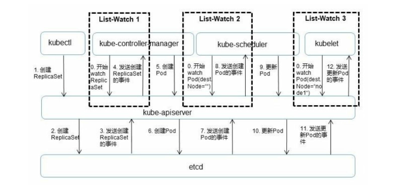

# apiserver

Kubernetes API Server 的核心功能是提供 Kubernetes 各类资源对象（如Pod、RC、Service等）的增、删、改、查及 Watch 等 HTTP Rest 接口，成为集群内各个功能模块之间数据交互和通信的中心枢纽，是整个系统的数据总线和数据中心。除此之外，它还有以下一些功能特性。 

+ 是集群管理的API入口。
+ 是资源配额控制的入口。 
+ 提供了完备的集群安全机制。

## 概述

Kubernetes API Server 由 kube-apiserver 的进程提供服务，该进程运行在 Master 上。在默认情况下，kube-apiserver 进程在本机的8080端口（对应参数--insecure-port）提供 REST 服务。我们可以同时启动 HTTPS 安全端口（--secure-port=6443）来启动安全机制，加强 REST API 访问的安全性。 

Pod 中的进程如何知道 API Server的访问地址呢？答案很简单：Kubernetes API Server 本身也是一个 Service，它的名称就是kubernetes，并且它的 Cluster IP 地址是 Cluster IP 地址池里的第1个 地址！另外，它所服务的端口是 HTTPS端口443，通过 kubectl get service 命令可以确认这一点：

```
[root@master ~]# kubectl get service
NAME          TYPE        CLUSTER-IP       EXTERNAL-IP   PORT(S)          AGE
kubernetes    ClusterIP   10.96.0.1        <none>        443/TCP          36d
```

由于 API Server 是 Kubernetes 集群数据的唯一访问入口，因此安全性
与高性能就成为 API Server 设计和实现的两大核心目标。通过采用 HTTPS 安全传输通道与CA签名数字证书强制双向认证的方式，API Server 的安全性得以保障。此外，为了更细粒度地控制用户或应用对 Kubernetes 资源对象的访问权限，Kubernetes 启用了 RBAC 访问控制策略。

API Server 的性能是决定 Kubernetes 集群整体性能的关键因素，因此 Kubernetes 的设计者综合运用以下方式来最大程度地保证 API Server 的性能。

1. API Server 拥有大量高性能的底层代码。在 API Server 源码中 使用协程（Coroutine）+队列（Queue）这种轻量级的高性能并发代码，使得单进程的 API Server 具备了超强的多核处理能力，从而以很快的速度并发处理大量的请求。
2.  普通 List 接口结合异步 Watch 接口，不但完美解决了 Kubernetes 中各种资源对象的高性能同步问题，也极大提升了Kubernetes 集群实时响应各种事件的灵敏度。
3.  采用了高性能的 etcd 数据库而非传统的关系数据库，不仅解决了数据的可靠性问题，也极大提升了 API Server 数据访问层的性能。在常见的公有云环境中，一个3节点的etcd集群在轻负载环境中处理一个请 求的时间可以低于1ms，在重负载环境中可以每秒处理超过30000个请求。

正是由于采用了上述提升性能的方法，API Server 可以支撑很大规模的 Kubernetes 集群。

## 架构解析

API Server的架构从上到下可以分为以下几层，

1. API层：主要以 REST 方式提供各种 API 接口，除了有 Kubernetes 资源对象的 CRUD 和 Watch 等主要API，还有健康检查、UI、 日志、性能指标等运维监控相关的API
2. 访问控制层：当客户端访问 API 接口时，访问控制层负责对用 户身份鉴权，验明用户身份，核准用户对 Kubernetes 资源对象的访问权 限，然后根据配置的各种资源访问许可逻辑（Admission Control），判断是否允许访问。
3. 注册表层：Kubernetes 把所有资源对象都保存在注册表 （Registry）中，针对注册表中的各种资源对象都定义了：资源对象的 类型、如何创建资源对象、如何转换资源的不同版本，以及如何将资源 编码和解码为 JSON 或 ProtoBuf 格式进行存储。 
4. etcd数据库：用于持久化存储 Kubernetes 资源对象的KV数据库。etcd的watch API 接口对于 API Server 来说至关重要，因为通过这个接口，API Server 创新性地设计了 List-Watch 这种高性能的资源对象实 时同步机制，使 Kubernetes 可以管理超大规模的集群，及时响应和快速 处理集群中的各种事件。

从本质上看，API Server 与常见的 MIS 或 ERP 系统中的 DAO 模块类 似，可以将主要处理逻辑视作对数据库表的 CRUD 操作。这里解读 API Server 中资源对象的 List-Watch 机制。下图以一个完整的 Pod 调度过程为例，对 API Server 的 List-Watch 机制进行说明。



首先，借助 etcd 提供的 Watch API 接口，API Server 可以监听 （Watch）在 etcd 上发生的数据操作事件，比如 Pod 创建事件、更新事件、删除事件等，在这些事件发生后，etcd 会及时通知 API Server。上图中 API Server 与 etcd 之间的交互箭头表明了这个过程：当一个 ReplicaSet 对象被创建并被保存到 etcd 中后（图中的2.Create RepliatSet箭 头），etcd 会立即发送一个对应的 Create 事件给 API Server（图中的 3.Send RepliatSet Create Event箭头），与其类似的6、7、10、11箭头都 是针对 Pod 的创建、更新事件的。 

然后，为了让 Kubernetes 中的其他组件在不访问底层 etcd 数据库的 情况下，也能及时获取资源对象的变化事件，API Server 模仿 etcd 的 Watch API 接口提供了自己的 Watch 接口，这样一来，这些组件就能近乎 实时地获取它们感兴趣的任意资源对象的相关事件通知了。图5.3中 controller-manager、scheduler、kublet 等组件与 API Server 之间的3个标记 有 List-Watch 的虚框表明了这个过程。同时，在监听自己感兴趣的资源 的时候，客户端可以增加过滤条件，以 List-Watch 3 为例，node1 节点上 的 kubelet 进程只对自己节点上的 Pod 事件感兴趣。 

最后，Kubernetes List-Watch 用于实现数据同步的代码逻辑。客户端首先调用API Server 的 List 接口获取相关资源对象的全量数据并将其缓存到内存中，然后启动对应资源对象的 Watch 协程，在接收到 Watch 事件后，再根据事件的类型（比如新增、修改或删除）对内存中的全量资 源对象列表做出相应的同步修改，从实现上来看，这是一种全量结合增量的、高性能的、近乎实时的数据同步方式。 

根据Kubernetes的设计，每种官方内建的资源对象如 Node、 Pod、Service 等的实现都包含以下主要功能。 

1. 资源对象的元数据（Schema）的定义：可以将其理解为数据 库 Table 的定义，定义了对应资源对象的数据结构，官方内建资源对象 的元数据定义是固化在源码中的。
2. 资源对象的校验逻辑：确保用户提交的资源对象的属性的合 法性。
3. 资源对象的 CRUD 操作代码：可以将其理解为数据库表的 CRUD 代码，但比后者更难，因为 API Server 对资源对象的 CRUD 操作都会保存到 etcd 数据库中，对处理性能的要求也更高，还要考虑版本兼容性和版本转换等复杂问题。
4. 资源对象相关的“自动控制器”（如RC、Deployment 等资源对 象背后的控制器）：这是很重要的一个功能。因为 Kubernetes 是一个以
自动化为核心目标的平台，用户给出期望的资源对象声明，运行过程中 则由资源背后的“自动控制器”负责，确保对应资源对象的数量、状态、 行为都始终符合用户的预期。 

类似地，每个自定义 CRD 的开发人员都需要实现上面这些功能。为 了减小编程的难度与工作量，API Server 的设计者们做出了大量的努 力，使得上面前3个功能无须编程实现，直接编写 YAML 定义文件即可 实现。对于唯一需要编程的第4个功能来说，由于API Server提供了大量 的基础API库，特别是易用的 List-Watch 的编程框架，也使得 CRD 自动控 制器的编程难度大大减小

## 集群功能模块通信

Kubernetes API Server 作为集群的核心，负责集群各功能模块之间的通信。集群内的各个功能模块通过 API Server 将 信息存入 etcd，当需要获取和操作这些数据时，则通过 API Server 提供的 REST 接口（用GET、LIST或WATCH方法）来实现，从而实现各模块之间的信息交互。

常见的一个交互场景是 kubelet 进程与 API Server 的交互。每个 Node 上的 kubelet 每隔一个时间周期，就会调用一次 API Server 的REST接口报 告自身状态，API Server 在接收到这些信息后，会将节点状态信息更新到 etcd 中。此外，kubelet 也通过 API Server 的 Watch 接口监听 Pod 信息， 如果监听到新的 Pod 副本被调度绑定到本节点，则执行 Pod 对应的容器创建和启动逻辑；如果监听到 Pod 对象被删除，则删除本节点上相应的 Pod 容器；如果监听到修改 Pod 的信息，kubelet 就会相应地修改本节点的 Pod 容器。 

另一个交互场景是 kube-controller-manager 进程与 API Server 的交
互。kube-controller-manager 中的 Node Controller 模块通过 API Server 提供 的 Watch 接口实时监控 Node 的信息，并做相应处理。

还有一个比较重要的交互场景是 kube-scheduler 与 API Server 的交 互。Scheduler 通过 API Server 的 Watch 接口监听到新建 Pod 副本的信息 后，会检索所有符合该 Pod 要求的 Node 列表，开始执行 Pod 调度逻辑，在调度成功后将 Pod 绑定到目标节点上。

为了缓解集群各模块对 API Server 的访问压力，各功能模块都采用 缓存机制来缓存数据。各功能模块定时从 API Server 获取指定的资源对 象信息（通过List-Watch方法），然后将这些信息保存到本地缓存中， 功能模块在某些情况下不直接访问 API Server，而是通过访问缓存数据来间接访问 API Server。
