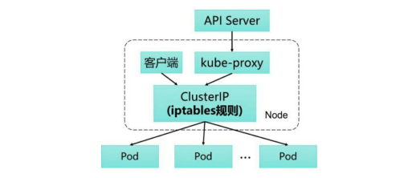

# kube-proxy

为了支持集群的水平扩展、高可用性，Kubernetes 抽象出了 Service 的概念。Service 是对一组 Pod 的抽象，它会根据访问策略（如负载均衡策略）来访问这组 Pod。

在 Kubernetes 集群的每个 Node 上都会运行一个 kube-proxy 服务进程，我们可以把这个进程看作 Service 的透明代理兼负载均衡器，其核心功能是将到某个 Service 的访问请求转发到后端的多个 Pod 实例上。Service 的 Cluster IP 与 NodePort 等概念是 kube-proxy 服务通过 iptables 的 NAT 转换实现的，kube-proxy 在运行过程中动态创建与 Service 相关的 iptables 规则，这些规则实现了将访问服务（Cluster IP 或 NodePort）的请求负载分发到后端 Pod 的功能。由于 iptables 机制针对的是本地的 kube-proxy 端口，所以在每个 Node 上都要运行 kube-proxy 组件，这样一来，在 Kubernetes 集群内部，我们可以在任意 Node 上发起对 Service 的访问请求。综上所述，由于 kube-proxy 的作用，在 Service 的调用过程中客户端无须关心后端有几个 Pod，中间过程的通信、负载均衡及故障恢复都是透明的。

Kubernetes 从1.2版本开始，将 iptables 作为 kube-proxy 的默认模式。iptable 模式下的 kube-proxy 不再起到 Proxy 的作用， 其核心功能：通过API Server 的 Watch 接口实时跟踪 Service 与 Endpoint 的变更信息，并更新对应的 iptables 规则，Client的请求流量则通过 iptables 的 NAT 机制“直接路由”到目标 Pod。

iptables 模式虽然实现起来简单，但存在无法避免的缺陷：在集群中的 Service 和 Pod 大量增加以后，iptables 中的规则会急速膨胀，导致性能显著下降，在某些极端情况下甚至会出现规则丢失的情况，并且这种故 障难以重现与排查。

kube-proxy 针对 Service 和 Pod 创建的一些主要的 iptables 规则如下。 

+ KUBE-CLUSTER-IP：在 masquerade-all=true 或 clusterCIDR 指定的情况下对 Service Cluster IP 地址进行伪装，以解决数据包欺骗问题。 
+ KUBE-EXTERNAL-IP：将数据包伪装成Service的外部IP地 址。 
+ KUBE-LOAD-BALANCER、KUBE-LOAD-BALANCER-LOCAL：伪装Load Balancer 类型的 Service 流量。 
+ KUBE-NODE-PORT-TCP、KUBE-NODE-PORT-LOCALTCP、KUBE-NODE-PORTUDP、KUBE-NODE-PORT-LOCAL-UDP： 伪装 NodePort 类型的 Service 流量。
