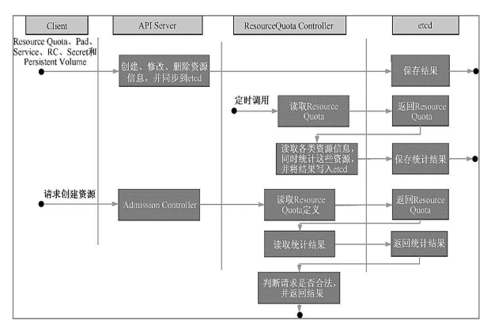

# ResourceQuota Controller

资源配额管理确保了指定的资源对象在任何时候都不会超量占用系统物理资源，避 免了由于某些业务进程的设计或实现的缺陷导致整个系统运行紊乱甚至意外宕机，对整个集群的平稳运行和稳定性有非常重要的作用。 目前Kubernetes支持如下三个层次的资源配额管理。 

+ 容器级别，可以对CPU和Memory进行限制。 
+ Pod级别，可以对一个Pod内所有容器的可用资源进行限制。
+ Namespace级别，为Namespace（多租户）级别的资源限制， 包括：
    + Pod数量；
    + Replication Controller数量；
    + Service数量；
    + ResourceQuota数量；
    + Secret数量；
    + 可持有的PV数量。

Kubernetes 的配额管理是通过 Admission Control（准入控制）来控制的，Admission Control 当前提供了两种方式的配额约束，分别是 LimitRanger 与 ResourceQuota。其中 LimitRanger 作用于 Pod 和 Container， ResourceQuota 则作用于 Namespace，限定一个 Namespace 里的各类资源的使用总额。 

如图所示，如果在 Pod 定义中声明了 LimitRanger，则用户通过 API Server 请求创建或修改资源时，Admission Control 会计算当前配额的使用情况，如果不符合配额约束，则创建对象失败。对于定义了 ResourceQuota 的 Namespace，ResourceQuota Controller 组件则负责定期统计和生成该 Namespace 下的各类对象的资源使用总量，统计结果包括 Pod、Service、RC、Secret和Persistent Volume 等对象实例个数，以及该 Namespace 下所有 Container 实例所使用的资源量（目前包括CPU和内 存），然后将这些统计结果写入 etcd 的 resourceQuotaStatusStorage 目录 （resourceQuotas/status）下。写入 resourceQuotaStatusStorage 的内容包含 Resource 名称、配额值（ResourceQuota对象中spec.hard域下包含的资源的值）、当前使用值（ResourceQuota Controller 统计出来的值）。随后这些统计信息被 Admission Control 使用，以确保相关 Namespace 下的资 源配额总量不会超过 ResourceQuota 中的限定值。

