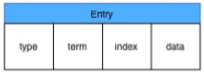
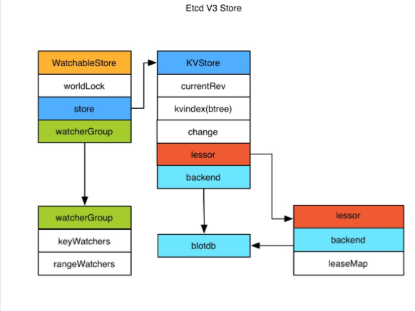

# etcd

Etcd是 CoreOS 基于 Raft 开发的分布式 key-value 存储，可用于服务发现、共享配置以及 一致性保障（如数据库选主、分布式锁等）。

## 功能

+ 基本的key-value存储 
+ 监听机制 
+ key的过期及续约机制，用于监控和服务发现 
+ 原子 CAS 和 CAD，用于分布式锁和leader选举

## 一致性

### 如何选举

1. 初始启动时，节点处于 follower 状态并被设定一个 election timeout，如果在这一 时间周期内没有收到来自 leader 的 heartbeat，节点将发起选举：将自己切换为 candidate  之后，向集群中其它 follower 节点发送请求，询问其是否选举自己成为 leader。 
2. 当收到来自集群中过半数节点的接受投票后，节点即成为 leader，开始接收保存 client    的数据并向其它的 follower 节点同步日志。如果没有达成一致，则 candidate 随机选择一个等待间隔（150ms ~ 300ms）再次发起投票，得到集群中半数以上 follower 接受的 candidate 将成为leader 
3. leader节点依靠定时向 follower 发送 heartbeat 来保持其地位。 
4. 任何时候如果其它 follower 在 election timeout 期间都没有收到来自 leader 的 heartbeat，同样会将自己的状态切换为 candidate 并发起选举。每成功选举一次，新 leader  的任期（Term）都会比之前 leader 的任期大1。

### 日志

当 leader 接收到客户端的日志（事务请求）后先把该日志追加到本地的Log中，然后通过 heartbeat 把该 Entry 同步给其他 Follower，Follower 接收到日志后记录日志然后向 Leader 发送ACK，当Leader收到大多数（n/2+1）Follower 的 ACK 信息后将该日志设置 为已提交并追加到本地磁盘中，通知客户端并在下个 heartbeat 中 Leader 将通知所有的 Follower 将该日志存储在自己的本地磁盘中。

### 安全性

安全性是用于保证每个节点都执行相同序列的安全机制，如当某个 Followe r在当前 Leader commit Log 时变得不可用了，稍后可能该 Follower 又会倍选举为Leader，这时新 Leader 可能会用新的 Log 覆盖先前已 committed 的 Log，这就是导致节点执行不同序列； Safety 就是用于保证选举出来的 Leader 一定包含先前 commited Log的机制；

+ 选举安全性（Election Safety）：每个任期（Term）只能选举出一个Leader 
+ Leader完整性（Leader Completeness）：指 Leader 日志的完整性，当 Log 在任期 Term1 被 Commit 后，那么以后任期 Term2、Term3…等的 Leader 必须包含该Log；Raft 在选举阶段就使用 Term 的判断用于保证完整性：当请求投票的该 Candidate 的 Term 较大或 Term 相同 Index 更大则投票，否则拒绝该请求。

### 失效处理

1. Leader 失效：其他没有收到 heartbeat 的节点会发起新的选举，而当 Leader 恢复 后由于步进数小会自动成为 follower（日志也会被新leader的日志覆盖） 
2. follower 节点不可用：follower 节点不可用的情况相对容易解决。因为集群中的 日志内容始终是从 leader 节点同步的，只要这一节点再次加入集群时重新从 leader 节点处复制日志即可。 
3.  多个 candidate：冲突后 candidate 将随机选择一个等待间隔（150ms ~ 300ms）再次发起投票，得到集群中半数以上 follower 接受的 candidate 将成为 leader

### wal 日志



wal 日志是二进制的，解析出来后是以上数据结构 LogEntry。其中第一个字段 type，只有 两种，一种是0表示 Normal，1表示 ConfChange（ConfChange表示 Etcd 本身的配置变 更同步，比如有新的节点加入等）。第二个字段是 term，每个 term 代表一个主节点的任 期，每次主节点变更 term 就会变化。第三个字段是 index，这个序号是严格有序递增的， 代表变更序号。第四个字段是二进制的 data，将raft request对象的pb结构整个保存下。 Etcd 源码下有 tools/etcd-dump-logs，可以将 wal 日志 dump 成文本查看，可以协助分 析 raft 协议。

raft 协议本身不关心应用数据，也就是 data 中的部分，一致性都通过同步 wal 日志来实现，每个节点将从主节点收到的 data apply 到本地的存储，raft 只关心日志的同步状态，如果本地存储实现的有 bug，比如没有正确的将 data apply 到本地，也可能会导致数据不一致。

## etcd v3 



Etcd v3 将 watch 和 store 拆开实现，我们先分析下 store 的实现。

Etcd v3 store 分为两部分，一部分是内存中的索引，kvindex，是基于 google 开源的一个 golang 的 btree 实现的，另外一部分是后端存储。按照它的设计，backend 可以对接多种 存储，当前使用的 boltdb。 boltdb 是一个单机的支持事务的 kv 存储，Etcd 的事务是基于 boltdb 的事务实现的。Etcd 在 boltdb 中存储的 key 是 reversion，value 是 Etcd 自己的 kv 组合，也就是说 Etcd 会在 boltdb 中把每个版本都保存下，从而实现了多版本机制

举个例子： 用 etcdctl 通过批量接口写入两条记录：

```
etcdctl txn <<<'
put key1 "v1"
put key2 "v2"
'
```

再通过批量接口更新这两条记录：

```
etcdctl txn <<<'
put key1 "v12"
put key2 "v22"   
'
```

boltdb中其实有了4条数据：

```
rev={3  0}, key=key1,   value="v1"  
rev={3  1}, key=key2,   value="v2"  
rev={4  0}, key=key1,   value="v12" 
rev={4  1}, key=key2,   value="v22"
```

reversion 主要由两部分组成，第一部分 main rev，每次事务进行加一，第二部分 sub rev，同一个事务中的每次操作加一。如上示例，第一次操作的 main rev是3，第二次是4。当然这种机制大家想到的第一个问题就是空间问题，所以 Etcd 提供了命令和设置选 项来控制 compact，同时支持put操作的参数来精确控制某个 key 的历史版本数。

了解了 Etcd 的磁盘存储，可以看出如果要从 boltdb 中查询数据，必须通过 reversion，但 客户端都是通过 key 来查询value，所以 Etcd 的内存 kvindex 保存的就是 key 和 reversion 之前的映射关系，用来加速查询。

然后我们再分析下 watch 机制的实现。Etcd v3 的 watch 机制支持 watch 某个固定的 key， 也支持 watch 一个范围（可以用于模拟目录的结构的watch），所以 watchGroup 包含两 种 watcher，一种是 key watchers，数据结构是每个 key 对应一组 watcher，另外一种是 range watchers, 数据结构是一个 IntervalTree，方便通过 区间查找到对应的watcher。

同时，每个 WatchableStore 包含两种 watcherGroup，一种是 synced，一种是 unsynced，前者表示该 group 的 watcher 数据都已经同步完毕，在等待新的变更，后者表 示该 group 的 watcher 数据同步落后于当前最新变更，还在追赶。

当 Etcd 收到客户端的 watch 请求，如果请求携带了 revision 参数，则比较请求的 revision 和 store 当前的 revision，如果大于当前 revision，则放入 synced 组中，否则放入 unsynced 组。同时 Etcd 会启动一个后台的 goroutine 持续同步 unsynced 的 watcher，然后将其迁移到 synced 组。也就是这种机制下，Etcd v3 支持从任意版本开始 watch，没有 v2的1000条历史 event 表限制的问题（当然这是指没有 compact 的情况下）。
