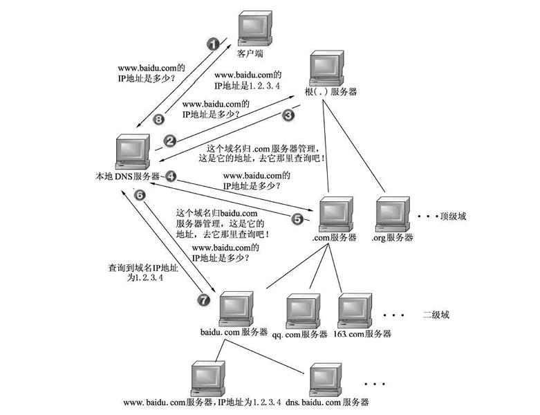

# DNS 解析过程

域名解析是查询域名对应 IP 的地址，其流程如下图所示

1. 应用发起查询域名对应 IP 地址的请求，先会到本地的 host 文件查找有没对应的记录。（本地 host 文件，linux 在 /etc/hosts 下， window 在 c:\windows\system32\drivers\etc\hosts）
2. 如果没有命中，请求发往本地 DNS 服务器，这台服务器一般在你的城市的某个角落，距离你不会很远，并且这台服务器的性能都很好，一般都会缓存域名解析结果，大约80%的域名解析到这里就完成了。
3. 如果本地 DNS 服务器没有命中，那么本地域名解析服务器将向根域名服务器发起解析请求。
4. 根服务器经过查询，没有记录该域名及 IP 地址的对应关系。但是会告诉本地 DNS 服务器，可以到顶级域名服务器上继续查询，并给出域名服务器的地址（.com 服务器）。
5. 本地 DNS 服务器向 .com 服务器发送 DNS 请求。
6. .com 服务器收到请求后，不会直接返回域名和 IP 地址的对应关系，而是告诉本地 DNS 服务器，该域名可以在 baidu.com 域名服务器上进行解析获取 IP 地址，并告诉 baidu.com 域名服务器的地址。
7. 本地 DNS 服务器向 baidu.com 域名服务器发送 DNS 请求。
8.  baidu.com 服务器收到请求后，在自己的缓存表中发现了该域名和 IP 地址的对应关系，并将IP地址返回给本地 DNS 服务器。
9. 本地 DNS 服务器将获取到与域名对应的 IP 地址返回给客户端，并且将域名和 IP 地址的对应关系保存在缓存中，以备下次别的用户查询时使用。

## 递归

主机向本地域名服务器的查询一般都是采用递归查询。

所谓递归查询就是：如果主机所询问的本地域名服务器不知道被查询的域名的 IP 地址，那么本地域名服务器就以 DNS 客户的身份，向其它根域名服务器继续发出查询请求报文(即替主机继续查询)，而不是让主机自己进行下一步查询。

## 迭代

本地域名服务器向根域名服务器的查询的迭代查询。

迭代查询的特点：当根域名服务器收到本地域名服务器发出的迭代查询请求报文时，要么给出所要查询的IP地址，要么告诉本地服务器：你下一步应当向哪一个域名服务器进行查询。然后让本地服务器进行后续的查询。