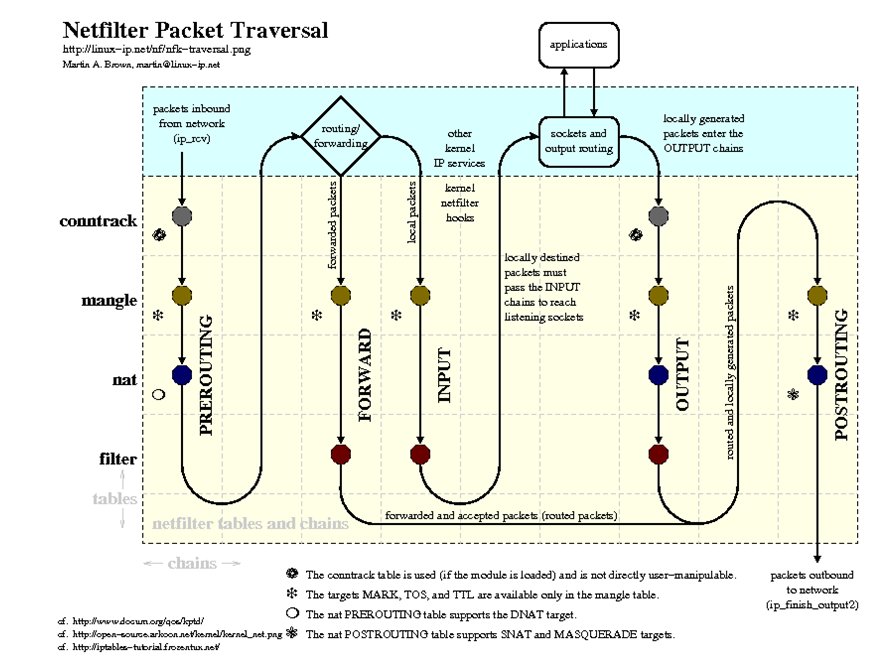
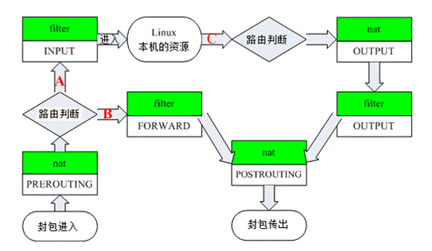

# iptables－四表五链

iptables 只是 Linux 防火墙的管理工具。真正实现防火墙功能的是 netfilter，它是 Linux 内核中实现包过滤的内部结构。

## 四表五链

iptables 包含四个表五个链。其中表是按照对数据包的操作区分的，链是按照不同的 Hook 点来区分的，表和链实际上是 netfilter 的两个维度。

四个表：

+ raw 表：决定数据包是否被状态跟踪机制处理
+ mangle 表：修改数据包的服务类型、TTL、并且可以配置路由实现QOS
+ nat 表：用于网络地址转换（IP、端口）
+ filter 表：过滤数据包

五个链：

+ PREROUTING链：对数据包作路由选择前应用此链中的规则
+ FORWARD链：转发数据包时应用此规则链中的策略
+ INPUT链：进来的数据包应用此规则链中的策略
+ OUTPUT链：外出的数据包应用此规则链中的策略
+ POSTROUTING链：对数据包作路由选择后应用此链中的规则

其的数据包流向，可形象的概括为如下图。

如图，基本步骤如下：

1. 数据库到达网络接口。例如 eth0。
2. 进入 `raw` 表的 `PREROUTING` 链。连接日志追踪在此处理。
3. 进入 `mangle` 表的 `PREROUTING` 链。可以修改数据包，比如 TOS。
4. 进入 `nat` 表的 `PREROUTING` 链。DNAT 处理等。
5. 进入路由，看是否给本机还是转发给其它机。

数据包发给本机：

6. 进入 `mangle` 表的 `INPUT` 链。
7. 进入 `filter` 表的 `INPUT` 链。对流入的所有数据包进行过滤。
8. 数据包交给本地应用程序。
9. 处理完毕后由路由决定，看发往哪里。
10. 进入 `raw` 表的 `OUTPUT` 链。这里是在连接跟踪处理本地的数据包之前。
11. 进入 `mangle` 表的 `OUTPUT` 链。在这里我们可以修改数据包，但不要做过滤。
12. 进入 `nat` 表的 `OUTPUT` 链。 NAT处理 。
13. 进入 `filter` 表的 `OUTPUT` 链，可以对本地出去的数据包进行过滤。 
14. 进入路由，决定发往哪里。
14. 进入 `mangle` 表的 `POSTROUTING` 链，到这里已经做完了所有的路由决定，但数据包仍然在本地主机，我们还可以进行某些修改。
15. 进入 `nat` 表的 `POSTROUTING` 链，在这里一般都是用来做 SNAT。
16. 出网。

数据包发给其它机：

6. 进入 `mangle` 表的 `FORWARD` 链。
7. 进入 `filter` 表的 `FORWARD` 链。对所有转发的数据包进行过滤。
8. 进入 `mangle` 表的 `POSTROUTING` 链。
9. 进入 `nat` 表的 `POSTROUTING` 链，在这里一般都是用来做 SNAT 。
10. 出网

由于四表中我们常用的只有 nat 和 filter，所以有精简图如下：

