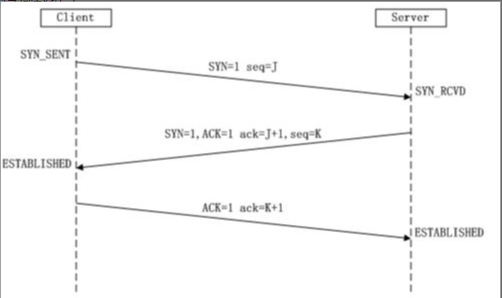
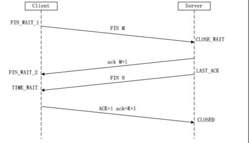

# tcp 三次握手和四次挥手

建立TCP需要三次握手才能建立，而断开连接则需要四次握手。

## 三次握手

三次握手图解如下：

1. 第一次握手：客户端发送syn包(syn=I)到服务器，并进入SYN_SEND状态，等待服务器确认；
2. 第二次握手：服务器收到syn包，必须确认客户的SYN（ack=I+1），同时自己也发送一个SYN包（syn=J），即SYN+ACK包，此时服务器进入SYN_RECV状态；
3. 第三次握手：客户端收到服务器的SYN＋ACK包，向服务器发送确认包ACK(ack=J+1)，此包发送完毕，客户端和服务器进入ESTABLISHED状态，完成三次握手

## 四次挥手

四次挥手图解如下：

1. 客户端发送一个 FIN=M 到服务端，客户端进入 FIN_WAIT_1 状态。
2. 服务端收到 FIN 后，服务端进入 CLOSE_WAIT 状态。然后发送一个 ACK=M+1 给客户端。
3. 发送 ACK 给客户端，同时会再发送一个 FIN=N 的包给客户端，服务端进入 LAST_ACK 状态。
4. 客户端收到 ACK 包后，客户端进入 FIN_WAIT_2 状态。客户端收到 FIN=N 包后，客户端进入 TIME_WAIT 状态。此时，客户端再发送一个 ACK 级服务端。
5. 服务端收到 ACK 包后，服务端进入 CLOSED 状态。

## 思考

#### 为什么建立连接协议是三次握手，而关闭连接却是四次握手呢？

这是因为服务端当收到 SYN 报文的建连请求后，它可以把 ACK 和 SYN（ACK起应答作用，而 SYN起同步作用）放在一个报文里来发送。但关闭连接时，当收到对方的 FIN 报文通知时，它仅仅表示对方没有数据发送给你了；但未必你所有的数据都全部发送给对方了，所以你可能未必会马上会关闭连接,可能还需要发送一些数据给对方之后，再发送FIN报文给对方来表示你同意现在可以关闭连接了，所以它这里的 ACK 报文和 FIN 报文多数情况下都是分开发送的。

#### 为什么建立连接协议不是二次握手？

三次握手完成两个重要的功能，既要双方做好发送数据的准备工作，也要允许双方就初始序列号进行协商，这个序列号在握手过程中被发送和确认。如果把三次握手改成二次握手可能会造成死锁。例如：计算机 S 和 C 之间的通信，如果 C 给 S 发送一个连接请求，S收到了这个请求，并发送了确认应答。按照两次握手的协定，S 认为连接已经成功地建立了，可以开始发送数据。可是，C 在级 S 的应答在传输中被丢失的情况下，将不知道 S 是否已准备好，不知道 S 建立什么样的序列号，C 甚至怀疑 S 是否收到自己的连接请求。在这种情况下，C 认为连接还未建立成功，将忽略 S 发来的任何数据，只等待连接确认应答。而 S 在发出的数据超时后，重复发送同样的数据。这样就形成了死锁。

#### 为什么TIME_WAIT 状态还需要等 2MSL 后才能返回到 CLOSED 状态？

虽然双方都同意关闭连接了，而且握手的 4 个报文也都协调和发送完毕，按理可以直接回到CLOSED状态。但是在络不可靠的情况下，无法保证最后发送的 ACK 报文会一定被对方收到，因此对方处于 LAST_ACK 状态下的连接可能会因为超时未收到 ACK 报文，而重发 FIN 报文，所以这个 TIME_WAIT 状态的作用就是用来重发可能丢失的 ACK 报文。

同时，报文可能会被混淆。在连接结束和连接建立时，需要一个缓冲期。如果没这个缓冲期，上一次连接结束的报文，可能还没发送完毕，而新的连接已建立。此时，会把上个连接没发送的报文数据直接发到新连接上来。造成报文混淆。

